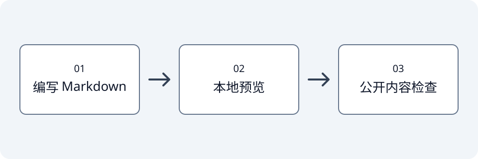

这是一篇明确标注的工程与写作预览示例，用于检查首页列表和文章阅读页，不代表正式技术文章。配图是本项目绘制的示意图，不含真实账号或截图。

[跳到配图示例](#配图示例)

## 中文正文

这里可以记录技术笔记与游戏攻略。文章标题可以修改，链接使用固定的 `slug`。

## 代码示例

```python
print("你好，世界！")
```

下面这行较长的代码用于检查窄屏下的横向滚动：

```python
article = {"title": "中文技术笔记", "slug": "build-preview", "description": "这是一行用于检查代码块横向滚动的示例，不包含真实用户数据或访问凭据。"}
```

## 配图示例

正文与图片放在同一个文章目录，通过相对路径引用。下图表示写作的三个步骤：编写、预览、检查。



图中最后一步是内容检查；确认准备公开的正文和配图后，再提交发布。

## 表格与链接

| 页面 | 用途 |
| --- | --- |
| 首页 | 浏览文章列表 |
| 文章页 | 阅读正文 |

[返回首页]()
