# Markdown Previewer 综合测试文档

> 目标：尽可能覆盖常见 Markdown / GFM / CommonMark / Mermaid / LaTeX / HTML 扩展语法。
>
> 不同 Previewer 对扩展语法的支持程度不同。**某些部分不渲染并不一定是错误**，也可能表示该扩展未启用。

---

## 目录

- [1. 标题](#1-标题)
- [2. 段落与换行](#2-段落与换行)
- [3. 文本样式](#3-文本样式)
- [4. 引用](#4-引用)
- [5. GitHub Alerts / Admonitions](#5-github-alerts--admonitions)
- [6. 列表](#6-列表)
- [7. 链接](#7-链接)
- [8. 图片](#8-图片)
- [9. 表格](#9-表格)
- [10. 代码](#10-代码)
- [11. LaTeX / 数学公式](#11-latex--数学公式)
- [12. Mermaid](#12-mermaid)
- [13. 脚注](#13-脚注)
- [14. HTML](#14-html)
- [15. 扩展语法](#15-扩展语法)
- [16. 字符与转义](#16-字符与转义)
- [17. Unicode / 多语言](#17-unicode--多语言)
- [18. 边界测试](#18-边界测试)

---

# 1. 标题

# H1 一级标题

## H2 二级标题

### H3 三级标题

#### H4 四级标题

##### H5 五级标题

###### H6 六级标题

Setext H1
=========

Setext H2
---------

### 显式 ID（部分解析器支持） {#custom-heading-id}

---

# 2. 段落与换行

这是第一段。Markdown 通常使用空行区分段落。

这是第二段。

这一行末尾有两个空格，因此下一行应该是硬换行。  
这是换行后的文本。

这一行使用 HTML `<br>`。<br>
这是 `<br>` 后的文本。

连续普通文本
如果没有两个空格或 `<br>`，
不同解析器可能把它们视为同一个段落中的软换行。

---

# 3. 文本样式

普通文本。

*斜体：星号*

_斜体：下划线_

**粗体：双星号**

__粗体：双下划线__

***粗斜体***

___粗斜体___

~~删除线~~

**粗体中包含 _斜体_**

_斜体中包含 **粗体**_

`行内代码`

这是一个 ``包含 ` 反引号的行内代码``。

下划线测试：foo_bar_baz

HTML 标记：<mark>高亮文本</mark>

HTML 删除：<del>deleted</del>

HTML 插入：<ins>inserted</ins>

上标：X<sup>2</sup>

下标：H<sub>2</sub>O

键盘按键：<kbd>Ctrl</kbd> + <kbd>Shift</kbd> + <kbd>P</kbd>

缩写（部分解析器支持）：

*[HTML]: HyperText Markup Language

HTML 是 Web 的基础技术之一。

---

# 4. 引用

> 一级引用

> 一级引用
>
> 第二段

> 一级
>
> > 二级
> >
> > > 三级

> ## 引用中的标题
>
> - 引用中的列表
> - 第二项
>
> ```js
> console.log("引用中的代码块");
> ```

---

# 5. GitHub Alerts / Admonitions

## 5.1 GitHub Alerts

> [!NOTE]
> 这是 NOTE。适合补充信息。

> [!TIP]
> 这是 TIP。适合建议或技巧。

> [!IMPORTANT]
> 这是 IMPORTANT。适合强调关键信息。

> [!WARNING]
> 这是 WARNING。适合风险提示。

> [!CAUTION]
> 这是 CAUTION。这里用于测试高风险警告样式。
>
> 多行内容也应该属于同一个 CAUTION。
>
> - 可以包含列表
> - 也可以包含 `inline code`

## 5.2 Obsidian 风格 Callout

> [!INFO]
> Obsidian / 部分 Markdown 引擎支持这种 callout。

> [!SUCCESS]
> 操作成功。

> [!FAILURE]
> 操作失败。

> [!QUESTION]
> 这是一个问题。

> [!EXAMPLE]
> 这是示例。

## 5.3 MkDocs / Python-Markdown Admonition

!!! note
    这是 MkDocs Material 常见 admonition 语法。

!!! warning "自定义标题"
    这是带标题的 warning。

??? tip "可折叠提示"
    某些解析器中这是可折叠 admonition。

## 5.4 Docusaurus / directive 风格

:::note
这是 directive 风格的 note。
:::

:::warning
这是 directive 风格的 warning。
:::

---

# 6. 列表

## 6.1 无序列表

- 苹果
- 香蕉
- 橙子

* 星号列表
* 第二项

+ 加号列表
+ 第二项

## 6.2 嵌套列表

- Level 1
  - Level 2
    - Level 3
      - Level 4
- 回到 Level 1

## 6.3 有序列表

1. 第一项
2. 第二项
3. 第三项

自动编号：

1. One
1. Two
1. Three

从非 1 开始：

5. Five
6. Six
7. Seven

## 6.4 混合列表

1. 第一部分
   - 子项 A
   - 子项 B
2. 第二部分
   1. 子步骤 1
   2. 子步骤 2

## 6.5 任务列表 / Checkbox

- [x] 已完成
- [ ] 未完成
- [x] 支持 ~~删除线~~
- [ ] 支持 **粗体**
  - [x] 嵌套任务
  - [ ] 另一个嵌套任务

---

# 7. 链接

## 7.1 行内链接

[OpenAI](https://openai.com/)

[带标题的链接](https://example.com/ "Example Title")

## 7.2 自动链接

<https://example.com/>

<hello@example.com>

部分 GFM Previewer 也会自动识别：

https://example.org/path?q=markdown

## 7.3 引用式链接

这是一个 [引用式链接][ref-link]。

这是一个 [短引用链接][]。

[ref-link]: https://example.com/reference "Reference Link"
[短引用链接]: https://example.com/short

## 7.4 页面锚点

[跳到数学公式](#11-latex--数学公式)

[跳到 Mermaid](#12-mermaid)

---

# 8. 图片

## 8.1 普通图片


## 8.2 带标题图片


## 8.3 图片作为链接

[](https://example.com/)

## 8.4 HTML 图片尺寸


---

# 9. 表格

## 9.1 GFM 表格

| 左对齐 | 居中 | 右对齐 |
| :--- | :---: | ---: |
| A | B | 100 |
| C | D | 200 |
| `code` | **bold** | ~~300~~ |

## 9.2 内容复杂表格

| 类型 | 示例 | 备注 |
|---|---|---|
| 链接 | [Example](https://example.com/) | Markdown |
| 代码 | `const x = 1` | Inline |
| 数学 | $E=mc^2$ | 依赖 LaTeX |
| Emoji | ✅ 🚀 ⚠️ | Unicode |
| 转义 | \| | 管道符 |

## 9.3 HTML 表格

<table>
  <thead>
    <tr>
      <th>Feature</th>
      <th>Status</th>
    </tr>
  </thead>
  <tbody>
    <tr>
      <td>Markdown</td>
      <td>✅</td>
    </tr>
    <tr>
      <td>HTML</td>
      <td>Depends on sanitizer</td>
    </tr>
  </tbody>
</table>

---

# 10. 代码

## 10.1 普通 fenced code block

```text
This is plain text.
<xml>不会被当作 HTML 渲染</xml>
**不会被当作粗体**
```

## 10.2 JavaScript

```javascript
function greet(name) {
  console.log(`Hello, ${name}!`);
}

greet("Markdown");
```

## 10.3 TypeScript

```typescript
interface User {
  id: number;
  name: string;
  active: boolean;
}

const user: User = {
  id: 1,
  name: "Alice",
  active: true,
};
```

## 10.4 Python

```python
from dataclasses import dataclass

@dataclass
class Point:
    x: float
    y: float

def distance(p: Point) -> float:
    return (p.x ** 2 + p.y ** 2) ** 0.5

print(distance(Point(3, 4)))
```

## 10.5 Bash

```bash
#!/usr/bin/env bash
set -euo pipefail

echo "Hello Markdown"
printf '%s\n' "Testing syntax highlighting"
```

## 10.6 JSON

```json
{
  "name": "markdown-preview-test",
  "enabled": true,
  "features": ["gfm", "latex", "mermaid"],
  "count": 3
}
```

## 10.7 YAML

```yaml
server:
  host: 127.0.0.1
  port: 8080

features:
  - markdown
  - mermaid
  - latex
```

## 10.8 TOML

```toml
title = "Markdown Test"

[server]
host = "127.0.0.1"
port = 8080
```

## 10.9 SQL

```sql
SELECT
    user_id,
    COUNT(*) AS event_count
FROM events
WHERE created_at >= CURRENT_DATE - INTERVAL '7 days'
GROUP BY user_id
ORDER BY event_count DESC;
```

## 10.10 Rust

```rust
fn main() {
    let values = vec![1, 2, 3];
    let sum: i32 = values.iter().sum();
    println!("sum = {}", sum);
}
```

## 10.11 Diff

```diff
- const oldValue = 1;
+ const newValue = 2;

  console.log("unchanged");
```

## 10.12 HTTP

```http
GET /api/users/42 HTTP/1.1
Host: example.com
Accept: application/json
Authorization: Bearer <token>
```

## 10.13 嵌套 Markdown fenced block

下面使用四个反引号包住包含三个反引号的 Markdown：

````markdown
# Example

```js
console.log("nested fence");
```
````

## 10.14 缩进代码块

    const indented = true;
    console.log(indented);

---

# 11. LaTeX / 数学公式

> 注意：数学公式依赖 KaTeX、MathJax 或其他数学渲染器。

## 11.1 行内公式

爱因斯坦质能方程：$E = mc^2$。

勾股定理：$a^2+b^2=c^2$。

概率：$P(A \mid B)=\frac{P(B\mid A)P(A)}{P(B)}$。

## 11.2 块级公式

$$
E = mc^2
$$

$$
\frac{-b \pm \sqrt{b^2 - 4ac}}{2a}
$$

$$
\sum_{i=1}^{n} i = \frac{n(n+1)}{2}
$$

## 11.3 积分

$$
\int_{-\infty}^{+\infty} e^{-x^2}\,dx = \sqrt{\pi}
$$

## 11.4 极限

$$
\lim_{n \to \infty}\left(1+\frac{1}{n}\right)^n=e
$$

## 11.5 矩阵

$$
A =
\begin{bmatrix}
1 & 2 & 3 \\
4 & 5 & 6 \\
7 & 8 & 9
\end{bmatrix}
$$

## 11.6 方程组

$$
\begin{cases}
x + y = 10 \\
2x - y = 5
\end{cases}
$$

## 11.7 对齐公式

$$
\begin{aligned}
(a+b)^2
  &= a^2 + 2ab + b^2 \\
(a-b)^2
  &= a^2 - 2ab + b^2
\end{aligned}
$$

## 11.8 向量与集合

$$
\vec{v} = \begin{pmatrix}x\\y\\z\end{pmatrix},
\qquad
A \cap B,
\qquad
A \cup B,
\qquad
x \in \mathbb{R}
$$

## 11.9 希腊字母

$$
\alpha,\beta,\gamma,\delta,\epsilon,\theta,\lambda,\mu,\pi,\sigma,\phi,\omega
$$

## 11.10 数学字体

$$
\mathbb{R},\quad
\mathcal{F},\quad
\mathbf{x},\quad
\mathrm{d}x
$$

## 11.11 可选：mhchem

如果渲染器启用了 `mhchem`：

$$
\ce{H2O + CO2 -> H2CO3}
$$

---

# 12. Mermaid

> Mermaid 支持取决于 Previewer 是否加载 Mermaid。

## 12.1 Flowchart / 流程图

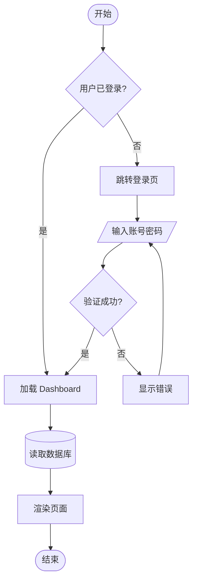

## 12.2 LR 横向流程图

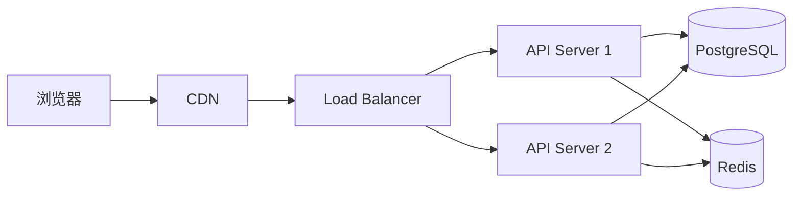

## 12.3 Sequence Diagram / 时序图

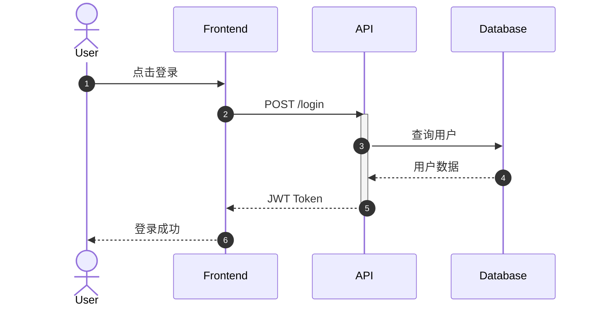

## 12.4 Class Diagram / 类图

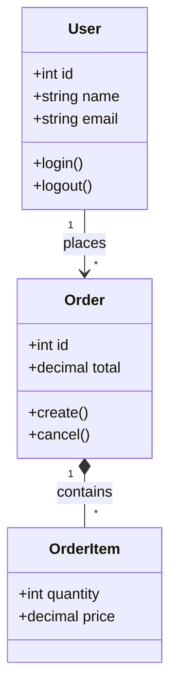

## 12.5 State Diagram / 状态图

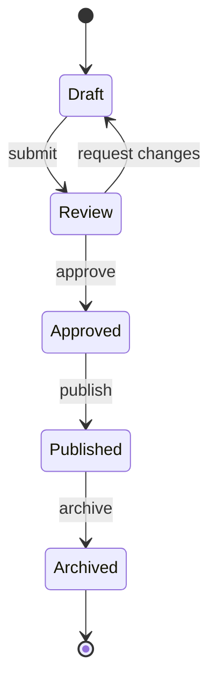

## 12.6 ER Diagram

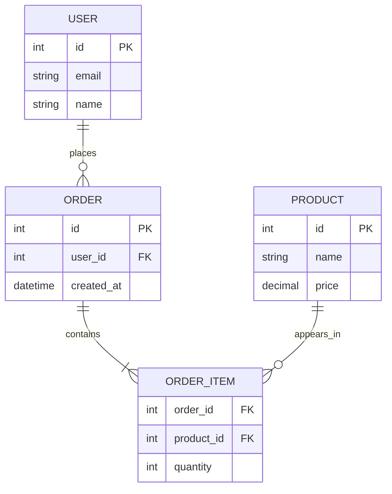

## 12.7 Gantt

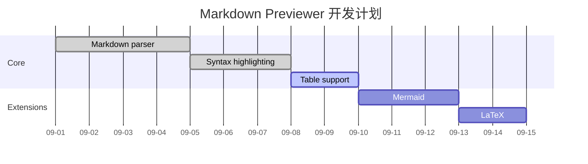

## 12.8 Pie

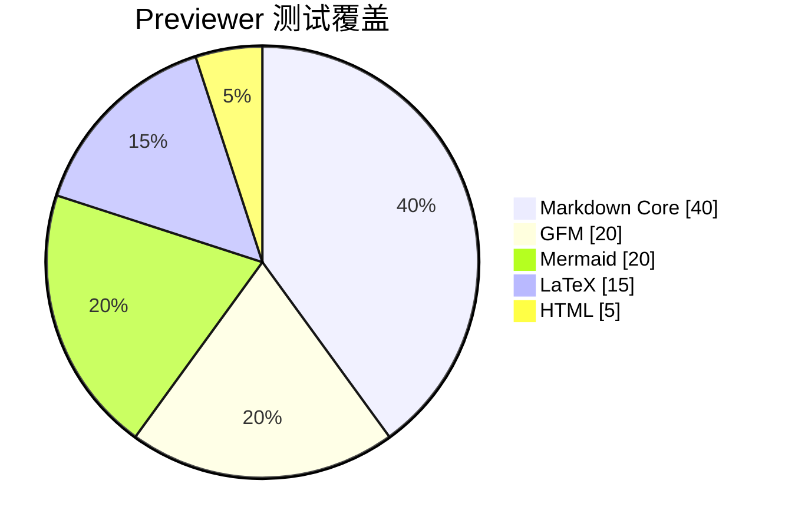

## 12.9 Mindmap

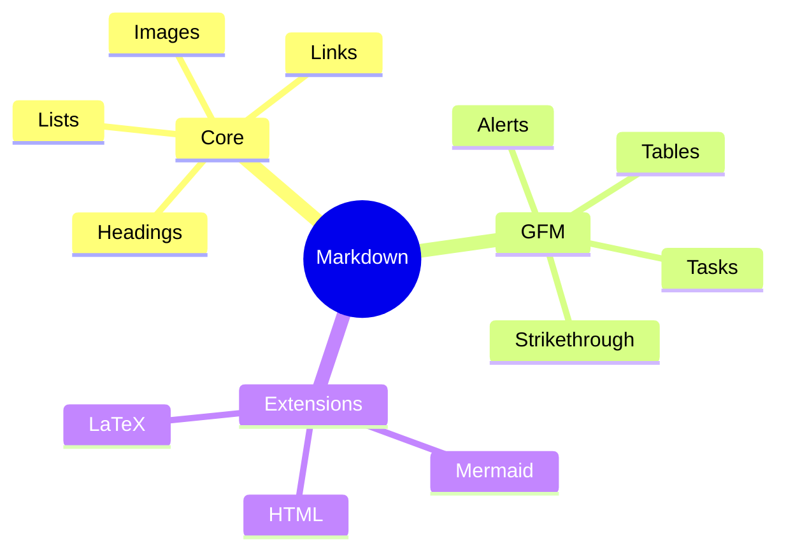

## 12.10 Timeline

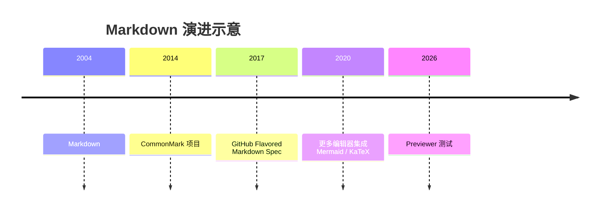

## 12.11 Git Graph

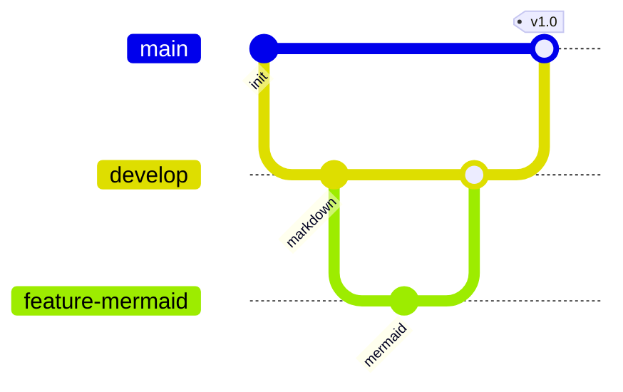

## 12.12 User Journey

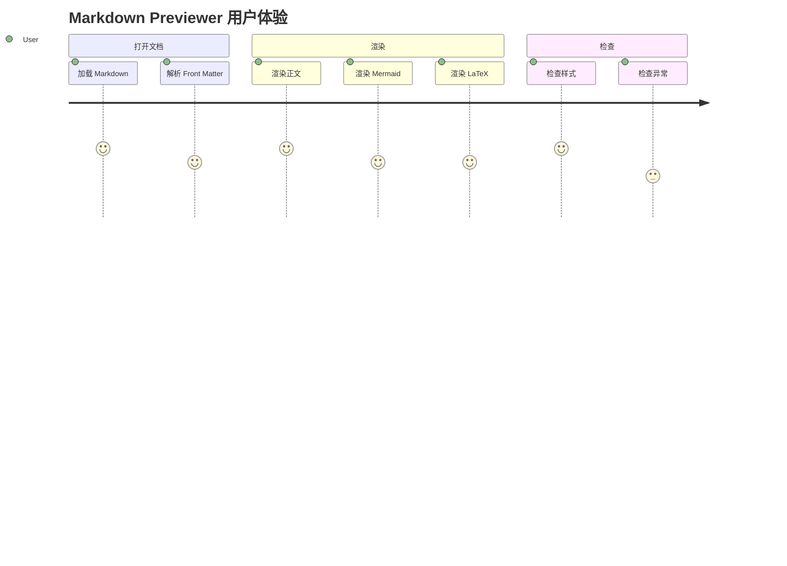

---

# 13. 脚注

这是一个带脚注的句子。[^1]

这是另一个脚注。[^long-note]

也可以尝试内联脚注（部分 Markdown 方言支持）。^[这是内联脚注。]

[^1]: 这是第一个脚注。

[^long-note]:
    这是一个多段脚注。

    它可以包含额外段落、列表等。

    - Item A
    - Item B

---

# 14. HTML

> 部分 Previewer 会禁用或 sanitize 原始 HTML。

## 14.1 Details / Summary

<details>
  <summary>点击展开详情</summary>

这里是折叠内容。

- 支持列表
- **支持 Markdown 与否取决于解析器**
- `inline code`

</details>

## 14.2 对齐

<div align="center">

**居中文本**

</div>

<div align="right">

右对齐文本

</div>

## 14.3 语义标签

<abbr title="Cascading Style Sheets">CSS</abbr>

<q>HTML inline quote</q>

<small>Small text</small>

<mark>Marked text</mark>

<time datetime="2026-09-10">2026-09-10</time>

## 14.4 Progress / Meter

<progress value="72" max="100">72%</progress>

<meter min="0" max="100" value="65">65%</meter>

## 14.5 HTML 注释

<!-- 这是一段 HTML 注释，正常情况下不应显示。 -->

注释之后的文本应该正常显示。

---

# 15. 扩展语法

## 15.1 Definition List

部分解析器（Pandoc、PHP Markdown Extra、Python-Markdown 扩展）支持：

Markdown
: 一种轻量级标记语言。

Mermaid
: 使用文本描述图表的语法。

KaTeX
: 高性能数学公式渲染库。

## 15.2 Wiki Links

部分笔记软件支持：

[[Markdown]]

[[Markdown|自定义显示文本]]

![[embedded-note]]

## 15.3 高亮扩展

部分解析器支持：

==高亮文本==

## 15.4 上标 / 下标扩展

部分解析器支持：

2^10^ = 1024

H~2~O

## 15.5 属性列表

部分解析器支持：

这是一段带属性的文本。
{.custom-class #custom-id data-test="hello"}

## 15.6 Emoji shortcode

如果支持 Emoji shortcode：

:smile: :rocket: :warning: :white_check_mark: :heart:

Unicode Emoji：

😀 😎 🚀 ✅ ❌ ⚠️ 🔥 📦 🧪 🧩

## 15.7 Mention / Issue / Commit 风格文本

@username

#123

abcdef1234567890

> 这些通常需要 GitHub 上下文才会自动链接。

---

# 16. 字符与转义

## 16.1 Markdown 特殊字符

以下字符经常具有特殊含义：

\* 星号  
\_ 下划线  
\# 井号  
\+ 加号  
\- 减号  
\. 点  
\! 感叹号  
\[ 左方括号  
\] 右方括号  
\( 左圆括号  
\) 右圆括号  
\> 大于号  
\` 反引号  
\\ 反斜杠

## 16.2 HTML Entity

&amp;

&lt;

&gt;

&quot;

&apos;

&copy;

&reg;

&trade;

&nbsp;

## 16.3 管道符

表格之外：|

转义：\|

代码：`a | b`

## 16.4 尖括号

普通：

`<div>hello</div>`

原始 HTML：

<div>hello from real HTML</div>

---

# 17. Unicode / 多语言

## 17.1 中文

简体中文：这是 Markdown 渲染测试。

繁體中文：這是 Markdown 預覽器測試。

## 17.2 日文

日本語：Markdown の表示テストです。

## 17.3 韩文

한국어: Markdown 미리보기 테스트입니다.

## 17.4 拉丁字符

English: The quick brown fox jumps over the lazy dog.

Français : Élève très âgé, déjà vu.

Deutsch: Füße, Größe, äußern.

Español: ¿Cómo está? ¡Muy bien!

## 17.5 RTL 文本

العربية: هذا اختبار Markdown.

עברית: זהו מבחן Markdown.

## 17.6 数学与符号

∞ ∑ ∏ ∫ √ ≠ ≈ ≤ ≥ ± × ÷ ∂ ∇ ∈ ∉ ⊂ ⊆ ∀ ∃

← ↑ → ↓ ↔ ⇒ ⇔

✓ ✔ ✕ ✖ ★ ☆ ♠ ♥ ♦ ♣

---

# 18. 边界测试

## 18.1 超长行

ABCDEFGHIJKLMNOPQRSTUVWXYZabcdefghijklmnopqrstuvwxyz0123456789ABCDEFGHIJKLMNOPQRSTUVWXYZabcdefghijklmnopqrstuvwxyz0123456789ABCDEFGHIJKLMNOPQRSTUVWXYZabcdefghijklmnopqrstuvwxyz0123456789ABCDEFGHIJKLMNOPQRSTUVWXYZabcdefghijklmnopqrstuvwxyz0123456789ABCDEFGHIJKLMNOPQRSTUVWXYZabcdefghijklmnopqrstuvwxyz0123456789

## 18.2 连续分隔线

---

***

___

## 18.3 容易混淆的列表

- item
---
- item after horizontal rule

1. ordered item
2. next item

2026. 这行是否被识别成列表，取决于上下文与解析器。

## 18.4 空链接与空图片

[](https://example.com/)


## 18.5 标题中的特殊字符

### C++ / C# / F#

### `code` in heading

### **Bold** and *Italic* in Heading

### Emoji 🚀 Heading

### 中文 / English / 日本語 Mixed Heading

## 18.6 URL 特殊字符

[Query String](https://example.com/search?q=markdown&lang=zh-CN)

[Encoded URL](https://example.com/a%20b/c%20d)

## 18.7 Code Fence 中的 Markdown

```markdown
# 这里不应该变成标题

**这里不应该变粗**

> 这里不应该变成引用

- 这里不应该变成列表

$E = mc^2$

```mermaid
A --> B
```
```

> 注意：上面这个示例故意考验 fenced code 的边界处理；某些解析器可能需要改用四反引号包裹。

## 18.8 连续反引号

普通：`code`

内部包含反引号：``const x = `template`;``

## 18.9 混合嵌套

> **引用中的粗体**
>
> 1. 有序列表
>    - 无序子列表
>      - [x] 任务
>      - [ ] 任务
>
> $$
> f(x)=x^2
> $$
>
> ```python
> print("deep nesting")
> ```

---

# 19. 额外 Mermaid 压力测试

## 19.1 带样式 Flowchart

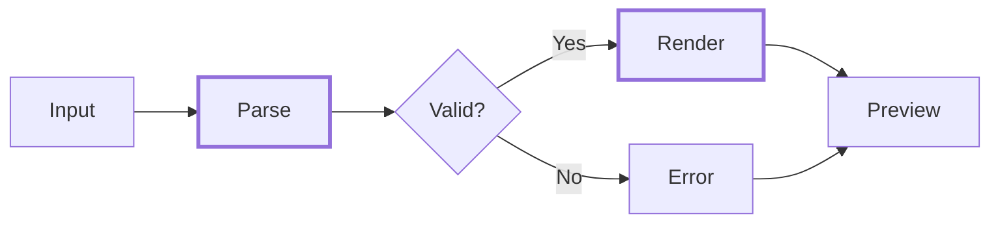

## 19.2 子图

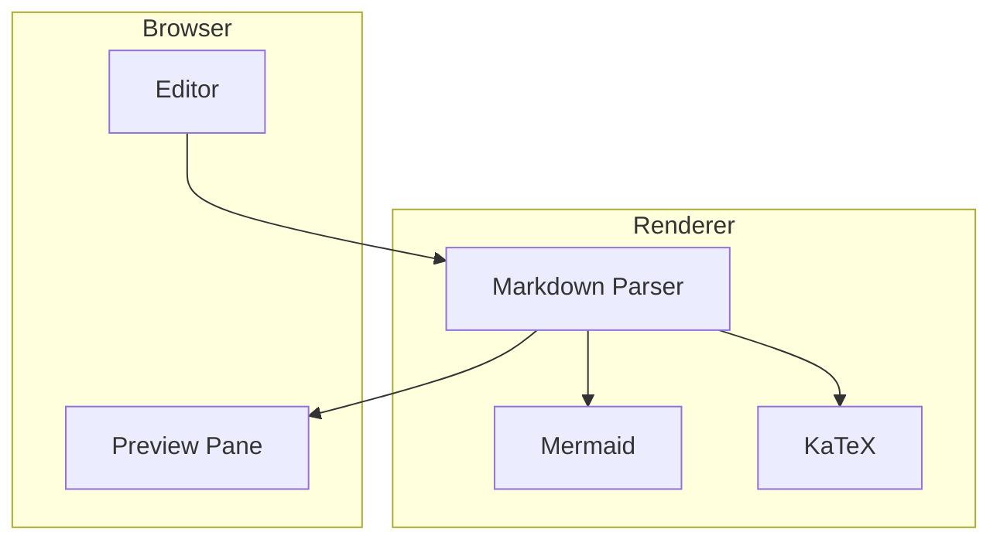

---

# 20. HTML 安全 / Sanitizer 测试

下面这些内容用于测试 sanitizer 的行为。

<iframe src="about:blank" title="iframe-test"></iframe>

<style>
.markdown-preview-test-style {
  font-weight: bold;
}
</style>

<span class="markdown-preview-test-style">如果 style 标签被保留，这行可能加粗。</span>

> 安全的 Previewer 通常会限制危险 HTML、事件处理器以及可执行脚本。
>
> 本文档**没有加入可执行 `<script>` 测试代码**，避免在不可信 Previewer 中产生副作用。

---

# 21. 最终检查清单

- [ ] H1 ~ H6 正常
- [ ] 粗体 / 斜体 / 删除线正常
- [ ] Inline code 正常
- [ ] Blockquote 正常
- [ ] Nested list 正常
- [ ] Task list 正常
- [ ] Table 正常
- [ ] Code highlighting 正常
- [ ] Links 正常
- [ ] Images 正常
- [ ] Footnotes 正常
- [ ] GitHub Alerts 正常
- [ ] HTML details 正常
- [ ] LaTeX inline math 正常
- [ ] LaTeX block math 正常
- [ ] Mermaid flowchart 正常
- [ ] Mermaid sequence diagram 正常
- [ ] Mermaid class diagram 正常
- [ ] Mermaid state diagram 正常
- [ ] Mermaid ER diagram 正常
- [ ] Mermaid Gantt 正常
- [ ] Mermaid pie 正常
- [ ] Mermaid mindmap 正常
- [ ] Mermaid timeline 正常
- [ ] Mermaid gitGraph 正常
- [ ] Mermaid journey 正常
- [ ] Unicode / CJK / RTL 正常
- [ ] Sanitizer 行为符合预期

---

# 22. End

**Markdown Previewer Test Complete.**

`EOF`
