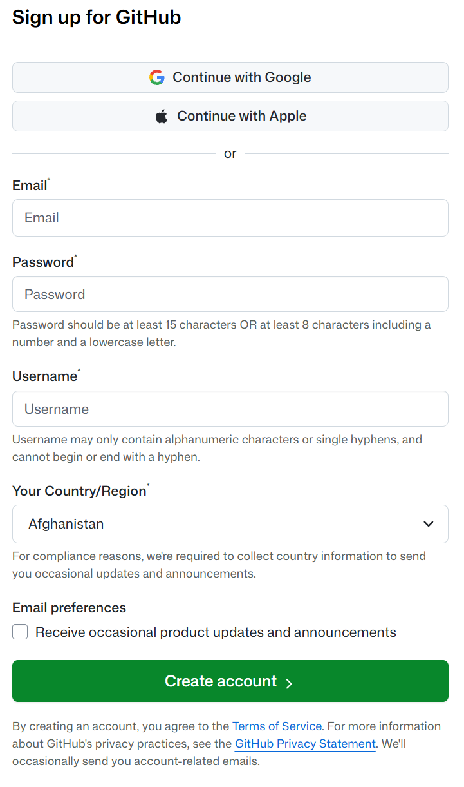
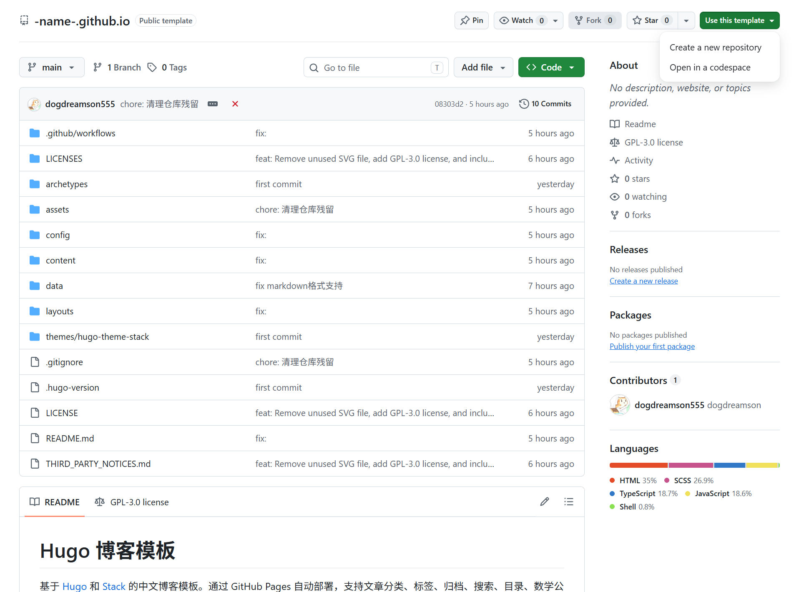
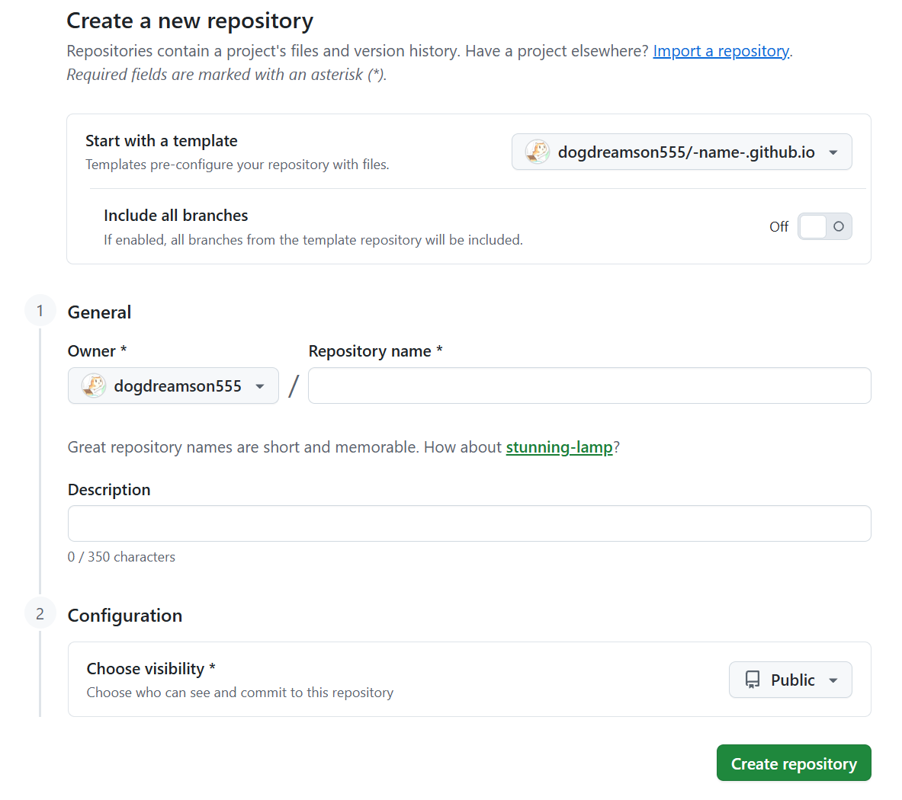
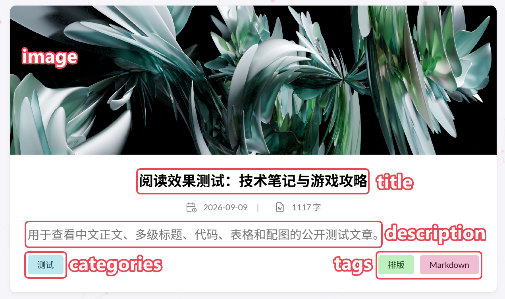
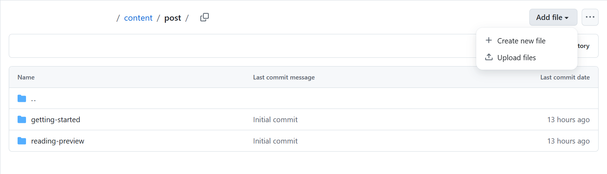
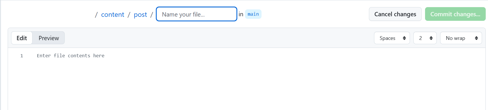
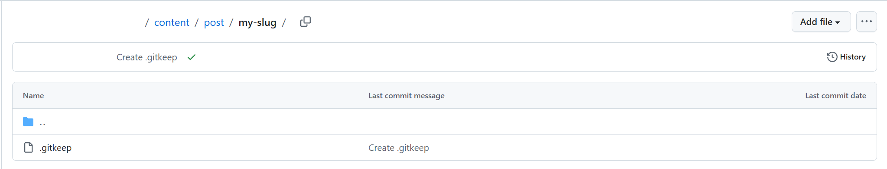
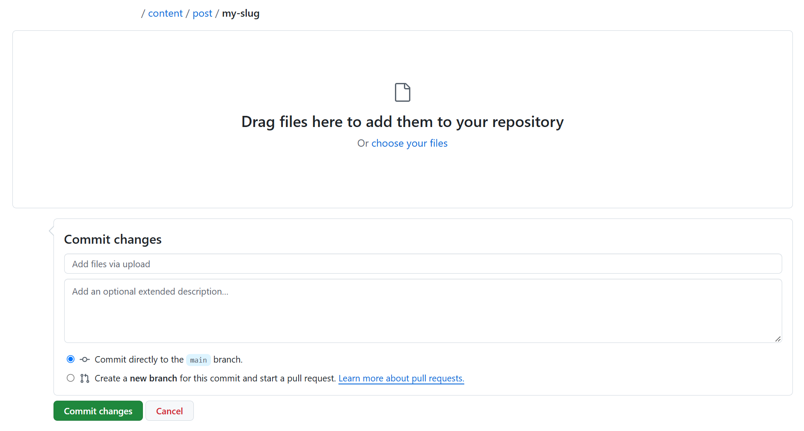
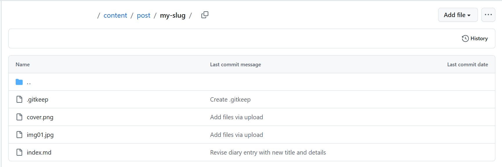

### 0. 注册一个 GitHub 账号

1. 进入 [GitHub](https://github.com/signup) 官网

<p align="center">
  
</p>

2. 输入邮箱和密码
3. 你的用户名（Username）

> [!IMPORTANT]
> 博客网站地址与你的用户名有关，最终会以“ https://\<Username\>.github.io/ ”的形式呈现

4. 选择国家与地区
5. 点击 Create account
6. 进行人机验证（有的人可能不用）
7. 最后从邮箱接受验证码，输入验证码启用账号

### 1.复制模板仓库并进入网站

进入[模板仓库](https://github.com/dogdreamson555/-name-.github.io)

<p align="center">
  
</p>

1. 点击 Use this template 使用模板
2. 点击 Create a new repository 新建仓库

<p align="center">
  
</p>

3. 输入你的仓库名称，名称取为 `<Username>.github.io` 。这里的 Username 就是你的 GitHub 用户名称，其中 “<” 和 “>” 不用写
4. 仓库描述（Description）可以不用管
5. 确保你的**仓库可见性**（visibility）为**公开**（Public）
6. 点击 Create repository 创建仓库
7. 最多等待5分钟（速度快的花30秒就成功构建），进入 <Username\>.github.io/ 就能看到你的博客网站了
8. 如果你看到这个界面，那么恭喜你，网站成功构建并上线

<p align="center">
  
</p>

### 2. 发布你的第一篇文章

**文章是怎么被发布的：**


0. 下载合适的 Markdown 编辑器，笔者这里推荐使用 [Obsidian](https://obsidian.md/) 或者 [Markpad](https://markpad.dev/)。如果不会使用 Markdown 来写文档，可以自搜“ xx 分钟学会 Markdown ”，也可以用 docs 文档让 AI 转成 Markdown 文档
1. 在 Markdown 文档最开头新增笔记属性。可以直接复制下方内容并添加修改

```markdown
---
title: "Markdown 写作示例"
date: 2020-01-02T00:00:00+08:00
slug: reading-preview
draft: false
description: "标题、代码、表格、公式和文章配图的简明示例。"
categories: ["示例"]
tags: ["Markdown", "写作"]
image: "cover.png"
---
```

> `title`：文章标题
> 
> `date`：文章发布的日期。需要自行填写，格式为：年-月-日T时-分-秒+时区。&emsp; &emsp;**注意**：未来日期的文章不会立即显示
>
> `slug`：网址里“用来表示这篇内容是什么”的那一小段名字。&emsp; &emsp; 例如: `example.com/blog/bulid-a-new-system`，这里的`bulid-a-new-system`就是 slug
>
> `draft`：确保发布前为 `flase`
>
> `description`：文章的简介
>
> `categories`：文章的分类
>
> `tags`：文章的标签
>
> `image`：文章的封面。封面会被裁剪为 16:5

<p align="center">
  
</p>

2. 往下继续编写 Markdown 文档。**最终要命名为 `index.md`**
3. 打开你的 GitHub 仓库，打开路径 content/post

<p align="center">
  
</p>

4. 点击 Add file - Create new file

<p align="center">
  
</p>

5. 在 “Name your file...” 输入你的 `slug`，后面再加上“/”。例如 `my-slug/`。这样子就会新建一个文件夹
6. 时候在“ Name your file... ”输入 `.gitkeep`。
7. 点击两次 Commit changes

<p align="center">
  
</p>

8. 在新建的文件夹下，点击 Add file - Upload files

<p align="center">
  
</p>

9. 将 index.md，和链接的图片或文件全部拖进去
10. 点击 Commit changes 即可

<p align="center">
  
</p>

11. 最多等待5分钟（速度快的花30秒就成功构建），进入 <Username\>.github.io/ 就能看到你的文章发布成功了
